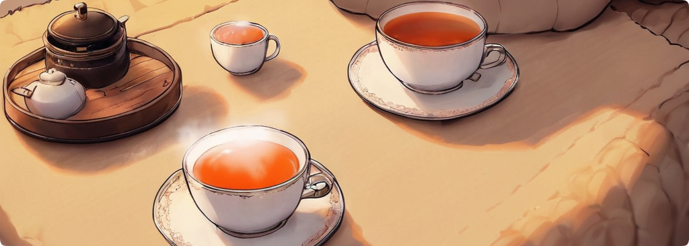

 

    

  

 

# Hi, I'm `Sebastian` 👋🏻

On my way through the Fog of life

 

<!-- Personal Overview -->
👨‍🎓 I study applied computer sience @HSMW and work as PHP api backend developer. Also I help with flutter fronted of the HSMWmobil app 🧑‍💻

My fields of interests are `Cybersecurity`, `Malware development`, and `Penetrationtesting`. All in all I like to experiment and have fun 😺

 

<!--Knowledge and Work Details -->
## ᴛᴇᴄʜᴛѕᴛᴀᴄᴋ - ᴋɴᴏᴡʟᴇᴅɢᴇ ᴀɴᴅ ᴛᴏᴏʟѕ 💻

      
        

<!-- Indepth detail information on github user -->
## sᴛᴀᴛs - ᴀᴅᴄʜɪᴠᴇᴍᴇɴᴛs 🏆​

 

<!--  -->
