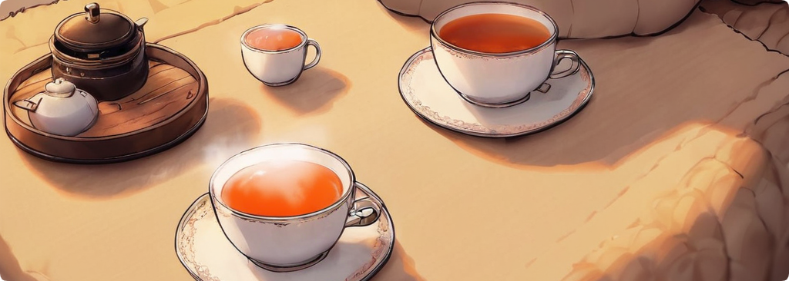

 

    

 

# ʜɪ, ɪ'ᴍ Sebastian 👋🏻

*On my way through the Fog of life*

 

*cybersecurity* • *malware development* • *penetrationtesting*

  

 

<!-- Personal Overview -->
👨‍🎓 I study applied computer sience @HSMW and I do part time work as a developer for the HSMWmobil project, mostly working on the backend and if needed on the App frontend 🧑‍💻.

 

 

<!--Knowledge and Work Details -->
## ᴛᴇᴄʜᴛѕᴛᴀᴄᴋ - ᴋɴᴏᴡʟᴇᴅɢᴇ ᴀɴᴅ ᴛᴏᴏʟѕ

 

           

 

